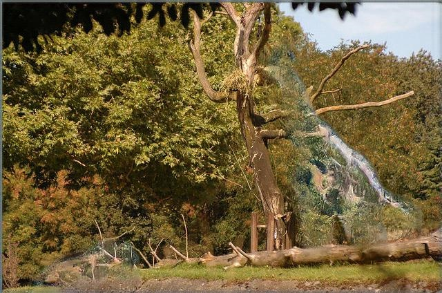

# VQA-MUTANT 

Code for **MUTANT: A Training Paradigm for Out-of-Distribution Generalization in Visual Question Answering**
- _Tejas Gokhale, Pratyay Banerjee, Chitta Baral, Yezhou Yang_
- EMNLP 2020 , https://arxiv.org/abs/2009.08566

## Augmented Data: Mutant Masks and Images.
These can be found as 3 directories in the Google drive link: https://drive.google.com/drive/folders/1QldD1BPDK8cojlrq2OhMeUYlmNo8RFGl?usp=sharing

- the masks dir contains the binary masks that we use to create each mutated image
- the 'masked' dir contains images with the masked region cropped out
- the 'images' dir contains the final mutated image

Each of these directories contains 'train2014' and 'val2014' according to the standard VQA split.
The example below shows the filename convention we used:

- *filename*    COCO_train2014_000000000025_number_giraffe_2
- *convention*  original COCO filename_type-of-question_name-of-object-removed_number of object instances removed

*Code is being cleaned and will be uploaded soon.*
